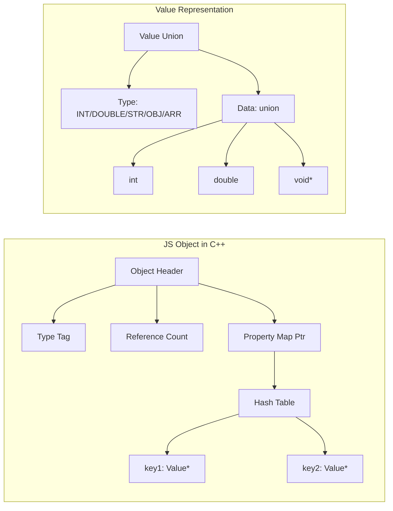
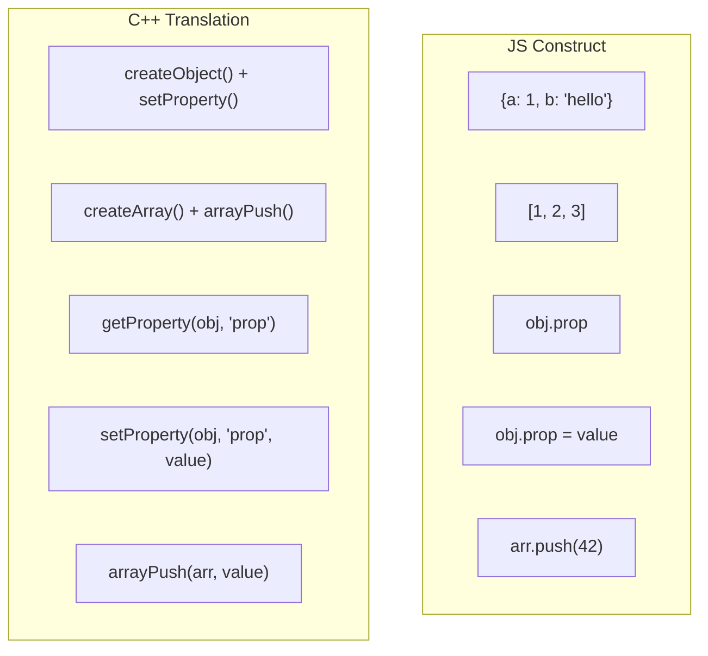
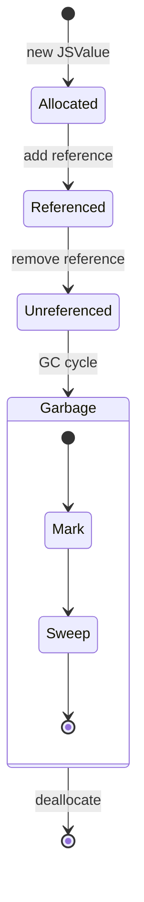
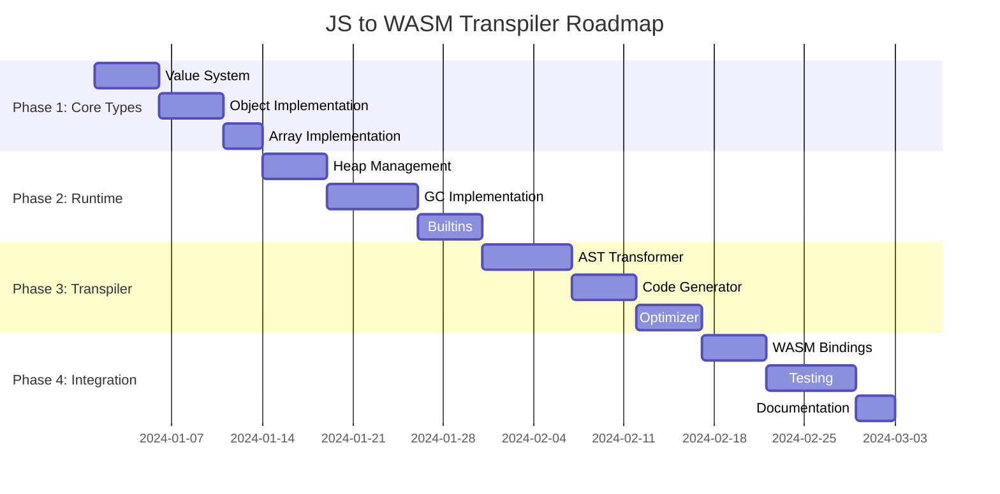
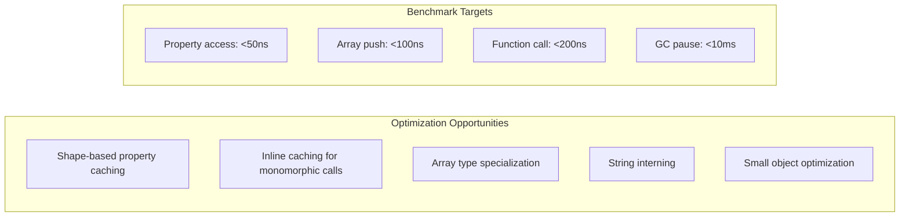

# **JS2WASM: A JavaScript to C++ Transpiler with WebAssembly Backend**

## **Architecture Overview**

```mermaid
graph TB
    subgraph "Frontend"
        JS[JavaScript Source] --> Lexer[Lexer]
        Lexer --> Parser[Parser]
        Parser --> AST[JS AST]
    end
    
    subgraph "Middleware"
        AST --> Analyzer[Semantic Analyzer]
        Analyzer --> Transformer[AST Transformer]
        Transformer --> CppGen[C++ Code Generator]
    end
    
    subgraph "Backend"
        CppGen --> CppSource[C++98 Source]
        CppSource --> C2C[C++ to C Transpiler]
        C2C --> CSource[C89 Source]
        CSource --> C2WAT[C to WAT Compiler]
        C2WAT --> WAT[WAT Code]
        WAT --> WasmGen[WASM Assembler]
        WasmGen --> WASM[WebAssembly Binary]
    end
    
    subgraph "Runtime"
        WASM --> Runtime[JS Runtime Environment]
        Runtime --> Browser[Browser/Node.js]
    end
```

## **Core Challenge: Object & Array Representation**

### **Memory Layout Strategy**



## **Implementation Proposal**

### **1. Core Type System (C++98)**

```cpp
// value.h
#ifndef VALUE_H
#define VALUE_H

#include <map>
#include <string>
#include <vector>

enum ValueType {
    TYPE_UNDEFINED,
    TYPE_NULL,
    TYPE_BOOLEAN,
    TYPE_NUMBER,
    TYPE_STRING,
    TYPE_OBJECT,
    TYPE_ARRAY,
    TYPE_FUNCTION
};

struct JSValue {
    ValueType type;
    union {
        bool bool_val;
        double num_val;
        struct {
            char* data;
            size_t length;
        } str_val;
        struct JSObject* obj_val;
        struct JSArray* arr_val;
    };
};

// JavaScript Object (HashMap based)
struct JSObject {
    std::map<std::string, JSValue*> properties;
    JSObject* prototype;
    size_t ref_count;
};

// JavaScript Array (dynamic array)
struct JSArray {
    std::vector<JSValue*> elements;
    size_t length;
    size_t ref_count;
};

// Function wrapper for JS functions called from C++
struct JSFunction {
    char* body;
    std::vector<std::string> params;
    JSValue* (*native_callback)(std::vector<JSValue*>);
};

#endif
```

### **2. Runtime Environment (C++98)**

```cpp
// runtime.h
#ifndef RUNTIME_H
#define RUNTIME_H

#include "value.h"

// Global heap management
class JSHeap {
private:
    std::vector<JSValue*> heap;
    std::vector<void*> free_list;
    
public:
    JSValue* allocate(ValueType type);
    void deallocate(JSValue* value);
    void gc();  // Mark-and-sweep garbage collector
};

// Type conversion utilities
class TypeConverter {
public:
    static double toNumber(JSValue* value);
    static bool toBoolean(JSValue* value);
    static std::string toString(JSValue* value);
    static JSValue* toObject(JSValue* value, JSHeap* heap);
};

// Built-in functions
class Builtins {
public:
    static JSValue* console_log(std::vector<JSValue*> args);
    static JSValue* array_push(std::vector<JSValue*> args);
    static JSValue* array_pop(std::vector<JSValue*> args);
    static JSValue* object_keys(std::vector<JSValue*> args);
};

#endif
```

### **3. Object Operations**

```cpp
// object_ops.h
#ifndef OBJECT_OPS_H
#define OBJECT_OPS_H

#include "value.h"

class ObjectOperations {
public:
    // Create operations
    static JSObject* createObject(JSHeap* heap);
    static JSArray* createArray(JSHeap* heap);
    
    // Property access
    static JSValue* getProperty(JSObject* obj, const std::string& key);
    static void setProperty(JSObject* obj, const std::string& key, JSValue* value);
    static bool hasProperty(JSObject* obj, const std::string& key);
    static bool deleteProperty(JSObject* obj, const std::string& key);
    
    // Array operations
    static JSValue* arrayGet(JSArray* arr, size_t index);
    static void arraySet(JSArray* arr, size_t index, JSValue* value);
    static void arrayPush(JSArray* arr, JSValue* value);
    static JSValue* arrayPop(JSArray* arr);
    static size_t arrayLength(JSArray* arr);
    
    // Prototype chain
    static JSValue* getPrototypeProperty(JSObject* obj, const std::string& key);
    
    // Iteration
    typedef void (*PropertyCallback)(const std::string&, JSValue*, void*);
    static void iterateProperties(JSObject* obj, PropertyCallback callback, void* userdata);
};

#endif
```

### **4. JavaScript to C++ Translation Mapping**



### **5. Transpilation Examples**

#### **JavaScript Input:**
```javascript
var obj = {
    name: "test",
    value: 42,
    nested: {
        flag: true
    }
};

var arr = [1, 2, 3];
arr.push(4);

function sum(a, b) {
    return a + b;
}

obj.nested.flag = false;
console.log(arr[2]);
```

#### **Generated C++ Output:**
```cpp
#include "runtime.h"

int main() {
    JSHeap* heap = new JSHeap();
    
    // var obj = { name: "test", value: 42, nested: { flag: true } };
    JSObject* obj = ObjectOperations::createObject(heap);
    ObjectOperations::setProperty(obj, "name", 
        TypeConverter::toJSString("test", heap));
    ObjectOperations::setProperty(obj, "value",
        TypeConverter::toJSNumber(42, heap));
    
    JSObject* nested = ObjectOperations::createObject(heap);
    ObjectOperations::setProperty(nested, "flag",
        TypeConverter::toJSBoolean(true, heap));
    ObjectOperations::setProperty(obj, "nested", nested);
    
    // var arr = [1, 2, 3];
    JSArray* arr = ObjectOperations::createArray(heap);
    ObjectOperations::arrayPush(arr, TypeConverter::toJSNumber(1, heap));
    ObjectOperations::arrayPush(arr, TypeConverter::toJSNumber(2, heap));
    ObjectOperations::arrayPush(arr, TypeConverter::toJSNumber(3, heap));
    
    // arr.push(4);
    ObjectOperations::arrayPush(arr, TypeConverter::toJSNumber(4, heap));
    
    // obj.nested.flag = false;
    JSValue* nested_val = ObjectOperations::getProperty(obj, "nested");
    ObjectOperations::setProperty(nested_val->obj_val, "flag",
        TypeConverter::toJSBoolean(false, heap));
    
    // console.log(arr[2]);
    JSValue* elem = ObjectOperations::arrayGet(arr, 2);
    Builtins::console_log(std::vector<JSValue*>(1, elem));
    
    delete heap;
    return 0;
}
```

### **6. Parser Integration (Your Existing JS Parser)**

```javascript
// Extended AST transformation rules
class JSToCppTransformer {
    constructor() {
        this.rules = {
            // Object literal: { key: value }
            ObjectExpression: (node) => {
                return this.generateObjectCreation(node.properties);
            },
            
            // Array literal: [1, 2, 3]
            ArrayExpression: (node) => {
                return this.generateArrayCreation(node.elements);
            },
            
            // Member access: obj.prop or obj['prop']
            MemberExpression: (node) => {
                return this.generateMemberAccess(node);
            },
            
            // Assignment: obj.prop = value
            AssignmentExpression: (node) => {
                if (this.isMemberAccess(node.left)) {
                    return this.generatePropertyAssignment(node);
                }
                return this.generateRegularAssignment(node);
            }
        };
    }
    
    generateObjectCreation(properties) {
        let code = "ObjectOperations::createObject(heap)";
        for (let prop of properties) {
            code += `\nObjectOperations::setProperty(temp, "${prop.key.name}", ${this.transform(prop.value)});`;
        }
        return code;
    }
    
    generateArrayCreation(elements) {
        let code = "ObjectOperations::createArray(heap)";
        for (let i = 0; i < elements.length; i++) {
            code += `\nObjectOperations::arrayPush(temp, ${this.transform(elements[i])});`;
        }
        return code;
    }
}
```

### **7. WebAssembly Integration Layer**

```wat
;; WASM interface for JS values
(module
  (import "js" "getProperty" (func $get_property (param externref) (param externref) (result externref)))
  (import "js" "setProperty" (func $set_property (param externref) (param externref) (param externref)))
  (import "js" "arrayPush" (func $array_push (param externref) (param externref)))
  (import "js" "arrayGet" (func $array_get (param externref) (param i32) (result externref)))
  
  (func (export "js_object_get") (param $obj externref) (param $key externref) (result externref)
    (call $get_property (local.get $obj) (local.get $key))
  )
  
  (func (export "js_object_set") (param $obj externref) (param $key externref) (param $value externref)
    (call $set_property (local.get $obj) (local.get $key) (local.get $value))
  )
)
```

### **8. Memory Management Strategy**



### **9. Implementation Roadmap**



### **10. Key Challenges & Solutions**

| Challenge | Solution |
|-----------|----------|
| **Dynamic properties** | HashMap-based JSObject with string keys |
| **Prototype chain** | Linked list of prototype objects with lazy resolution |
| **Garbage collection** | Reference counting + mark-and-sweep hybrid |
| **Type coercion** | Explicit conversion functions matching JS semantics |
| **Closures** | Capture environment as additional object parameter |
| **`this` binding** | Explicit `this` parameter in all method calls |
| **Exceptions** | C++ exceptions or error code returns |
| **Performance** | Inline caching for property access patterns |

### **11. Testing Strategy**

```cpp
// test_object.cpp
#include <assert.h>
#include "runtime.h"

void test_object_creation() {
    JSHeap heap;
    JSObject* obj = ObjectOperations::createObject(&heap);
    
    ObjectOperations::setProperty(obj, "test", 
        TypeConverter::toJSNumber(42, &heap));
    
    JSValue* val = ObjectOperations::getProperty(obj, "test");
    assert(val->type == TYPE_NUMBER);
    assert(val->num_val == 42);
}

void test_array_operations() {
    JSHeap heap;
    JSArray* arr = ObjectOperations::createArray(&heap);
    
    for(int i = 0; i < 100; i++) {
        ObjectOperations::arrayPush(arr, 
            TypeConverter::toJSNumber(i, &heap));
    }
    
    assert(ObjectOperations::arrayLength(arr) == 100);
    assert(ObjectOperations::arrayGet(arr, 50)->num_val == 50);
}
```

### **12. Performance Considerations**



## **Conclusion**

This architecture provides a complete path from JavaScript source to WebAssembly while maintaining JS semantics for objects and arrays. The key innovations are:

1. **Unified value representation** supporting all JS types
2. **HashMap-based objects** with prototype chain support  
3. **Dynamic arrays** matching JS array behavior
4. **Automatic memory management** with hybrid GC
5. **Seamless WASM integration** via externref

The existing lexer/parser can be extended with semantic analysis and C++ code generation following the mapping rules defined above. The runtime library provides the necessary support for JS features not available in C++98/WASM directly.
